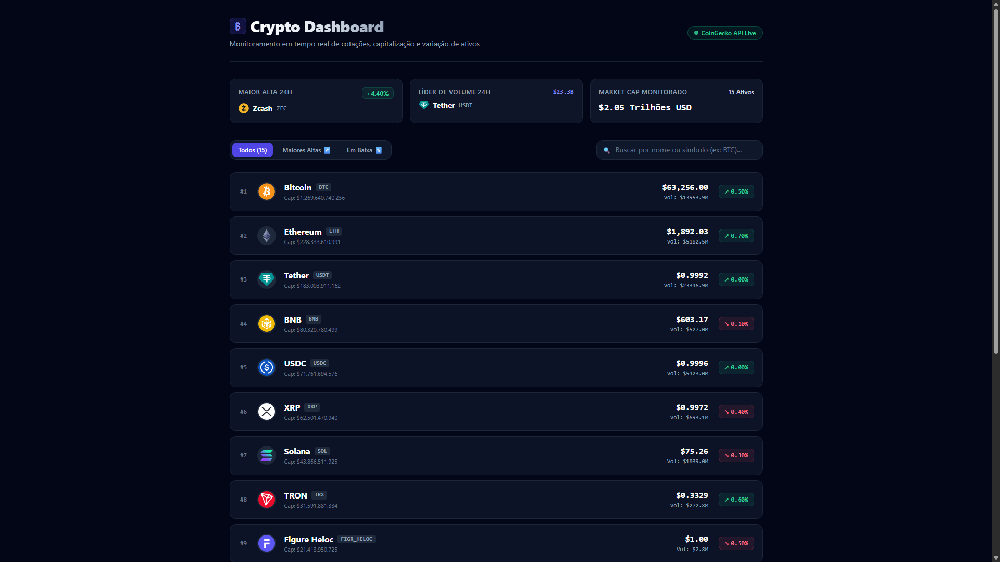

# Crypto Dashboard

Aplicação web para consulta das principais criptomoedas do mercado. O projeto utiliza Next.js e consome a API pública da CoinGecko para exibir cotações, busca e informações detalhadas de cada ativo.

## Status do projeto

**Concluído como projeto de estudo, com versão disponível em produção.**

As funcionalidades principais de listagem, busca e consulta de detalhes estão implementadas. O projeto pode continuar evoluindo com melhorias de testes, acessibilidade e tratamento de dados externos.

## Objetivo do projeto

O Crypto Dashboard foi criado para praticar o consumo de uma API externa em uma aplicação React com Next.js App Router.

O projeto trabalha conceitos como requisições assíncronas, estados de carregamento e erro, filtros no cliente, rotas dinâmicas e apresentação de dados financeiros em uma interface responsiva.

## Demonstração

- **Aplicação em produção:** [https://crypto-dashboard-five-sandy.vercel.app/](https://crypto-dashboard-five-sandy.vercel.app/)
- **Repositório:** [https://github.com/tharciosantos/crypto-dashboard](https://github.com/tharciosantos/crypto-dashboard)



## Funcionalidades implementadas

- Listagem das 10 criptomoedas com maior capitalização de mercado, considerando os dados retornados pela CoinGecko em dólar.
- Exibição do nome, símbolo, imagem e preço atual de cada criptomoeda.
- Busca em tempo real por nome ou símbolo.
- Navegação para a rota dinâmica `/coin/[id]`.
- Página individual de detalhes para cada criptomoeda.
- Exibição de preço atual e variação percentual nas últimas 24 horas.
- Exibição de capitalização de mercado, volume, máxima e mínima em 24 horas e posição no ranking.
- Descrição da criptomoeda em português, quando disponível, com conteúdo em inglês como alternativa.
- Tratamento de estados de carregamento, erro e lista vazia.
- Mensagens específicas para moeda não encontrada e limite de requisições da API.
- Layout adaptado para diferentes tamanhos de tela.

## Tecnologias utilizadas

### Front-end

- Next.js 15 com App Router
- React 19
- Tailwind CSS 3
- Tailwind CSS Typography

### Dados externos

- CoinGecko API
- Fetch API

### Qualidade e deploy

- ESLint
- Vercel

> O projeto não possui back-end próprio, banco de dados ou autenticação. Os dados são consultados diretamente da API pública da CoinGecko pelo navegador.

## Estrutura geral do projeto

```text
crypto-dashboard/
├── public/
│   └── screenshot-crypto.png       # Imagem utilizada no README
├── src/
│   └── app/
│       ├── coin/
│       │   └── [id]/
│       │       └── page.js         # Página dinâmica de detalhes
│       ├── globals.css             # Estilos globais
│       ├── layout.js               # Layout e metadados da aplicação
│       └── page.js                 # Listagem e busca de criptomoedas
├── next.config.mjs                 # Configuração do Next.js e imagens remotas
├── package.json                    # Dependências e scripts
└── tailwind.config.js              # Configuração do Tailwind CSS
```

## Como executar localmente

### Pré-requisitos

- Node.js compatível com o Next.js 15
- npm
- Conexão com a internet para consultar a CoinGecko API

### 1. Clone o repositório

```bash
git clone https://github.com/tharciosantos/crypto-dashboard.git
cd crypto-dashboard
```

### 2. Instale as dependências

```bash
npm install
```

### 3. Inicie a aplicação

```bash
npm run dev
```

A aplicação ficará disponível em [http://localhost:3000](http://localhost:3000).

### Scripts disponíveis

| Comando | Descrição |
| --- | --- |
| `npm run dev` | Inicia o servidor de desenvolvimento. |
| `npm run build` | Gera o build de produção. |
| `npm run start` | Inicia a aplicação a partir do build. |
| `npm run lint` | Executa o ESLint. |

## Variáveis de ambiente

O projeto não utiliza variáveis de ambiente atualmente.

Os endpoints públicos da CoinGecko estão definidos diretamente nas páginas que realizam as requisições. Não é necessário criar um arquivo `.env` para executar a aplicação.

## Testes

O projeto ainda não possui testes automatizados nem scripts de teste configurados no `package.json`.

A validação disponível atualmente é feita pelo ESLint e pelo processo de build do Next.js.

## Aprendizados

- Consumo de uma API pública com Fetch API.
- Tratamento de requisições assíncronas no React.
- Gerenciamento de estados de carregamento, erro e ausência de resultados.
- Busca e filtragem de dados no cliente.
- Criação de rotas dinâmicas com Next.js App Router.
- Uso de parâmetros de rota para consultar detalhes de um recurso.
- Formatação e apresentação de dados de mercado.
- Configuração de imagens remotas no Next.js.
- Construção de uma interface responsiva com Tailwind CSS.
- Deploy de uma aplicação Next.js na Vercel.

## Próximos passos

- **Planejado:** implementar testes automatizados para listagem, busca e página de detalhes.
- **Planejado:** melhorar a acessibilidade dos elementos interativos e estados de feedback.
- **Planejado:** adicionar uma opção para selecionar a moeda de referência dos valores.
- **Planejado:** aprimorar o tratamento de indisponibilidade e limite de requisições da CoinGecko.
- **Planejado:** adicionar paginação ou ampliar a quantidade de criptomoedas exibidas.
- **Planejado:** revisar a renderização do conteúdo HTML recebido nas descrições da API.

## Autor

**Nome:** Tharcio Santos  
**GitHub:** [https://github.com/tharciosantos](https://github.com/tharciosantos)  
**LinkedIn:** [https://www.linkedin.com/in/tharcio-santos-dev/](https://www.linkedin.com/in/tharcio-santos-dev/)  
**Portfólio:** [https://tharcio-portfolio.vercel.app/](https://tharcio-portfolio.vercel.app/)
